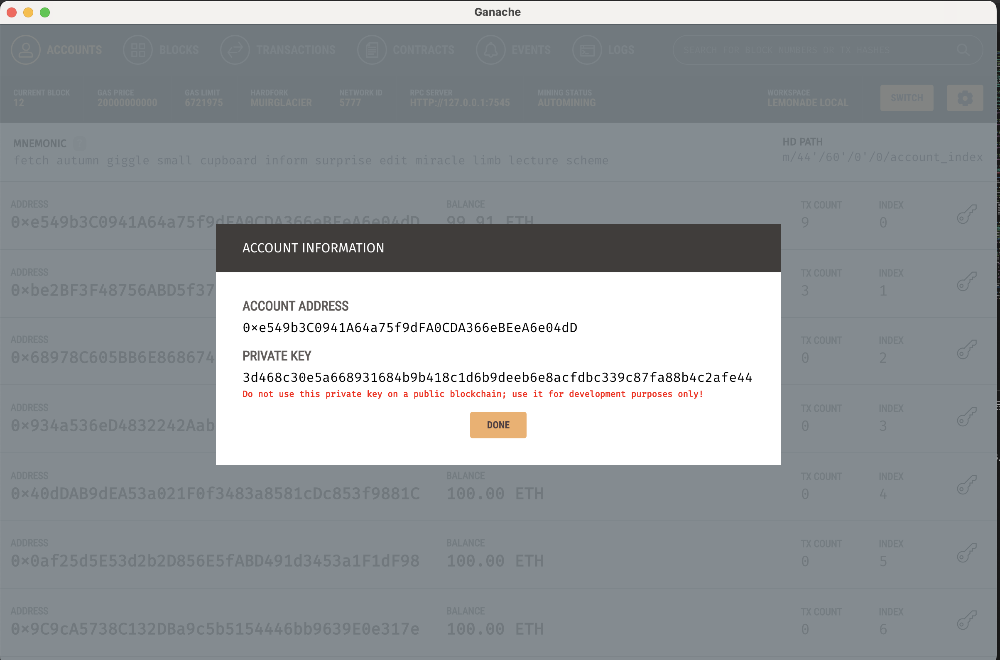

## Table of Contents
1. [General Info](#general-info)
2. [Prerequisites](#prerequisites)
3. [Installation Dapp](#installation-dapp)
4. [Launch Dapp](#launch-dapp)
5. [Known bugs](#known-bugs)
6. [Ganache GUI](#ganache-gui)
7. [MetaMask](#metamask)


## General Info

This repository contains an Ethereum DApp that demonstrates a Supply Chain flow between a Seller and Buyer. The user story is similar to any commonly used supply chain process. A Seller can add items to the inventory system stored in the blockchain. A Buyer can purchase such items from the inventory system.

#### Supply process

 

##### Supply localhost

 


The starter code is written for **Solidity v0.8.1**

(please refer to Solidity [documentation](https://docs.soliditylang.org/en/v0.8.1/index.html) for more details). 

To use this starter code, please run `npm i -g truffle@5.7.0` to install Truffle v5 with Solidity v0.8.1. 

## Prerequisites

Please make sure you've already installed ganache-cli, Truffle and enabled MetaMask extension in your browser.

For this project, you will need to have:
* Node and NPM
* Truffle
* Ganache

Node and NPM installed - NPM is distributed with Node.js

Download and install Node.js v18.12.1

https://nodejs.org/download/release/v18.12.1/

#### Check Node version
```
node -v
v18.12.1
```
#### Check NPM version
```
npm -v
8.19.2
```

#### Install Truffle
```
npm i -g truffle@5.7.0
```


## Installation Dapp


Clone this repository:

```
git clone https://github.com/thomasbln/lemonade-supply-chain.git
```

```
cd  lemonade-supply-chain
```


Launch Ganache

```
truffle develop
```

Your terminal should look something like this:


In a separate terminal window, Compile smart contracts:

```
compile
```

Your terminal should look something like this:


Test smart contracts

```
test
```

Your terminal should look something like this:


Migrate smart contracts to the locally running blockchain, ganache-cli:

```
migrate --reset
```
This will create the smart contract artifacts in folder ```build\contracts```.
Your terminal should look something like this:


## Launch Dapp 
In a separate terminal window, launch the DApp:

```
cd  lemonade-supply-chain/app
npm run dev
```
Open your browser:  http://localhost:8080
 
 
## Known bugs

#### ERR_OSSL_EVP_UNSUPPORTED

When you run npm run dev you may get the following error:

 


In a terminal window:

```
export NODE_OPTIONS=--openssl-legacy-provider
```
launch the DApp:

```
cd  lemonade-supply-chain/app
npm run dev
```


## Ganache Gui

If you prefer to work with Ganache GUI, you must first change the port to 7545 in truffle-config.js.

```
   development: {
      host: "127.0.0.1",     // Localhost (default: none)
      port: 7545,            // Standard Ethereum port Ganache GUI
      network_id: "*", 
      gas: 2100000,
     },
```

```
   development: {
      host: "127.0.0.1",     // Localhost (default: none)
      port: 9545,            // Standard Ethereum port ganache-cli
      network_id: "*", 
      gas: 2100000,
     },
```

<br>

#### Create New Workspace


#### Ganache project settings


#### Export private key




## MetaMask

#### MetaMask import Account
 


#### MetaMask add localhost:7545 Ganache GUI

 


#### MetaMask add localhost:9545 ganache-cli
 

